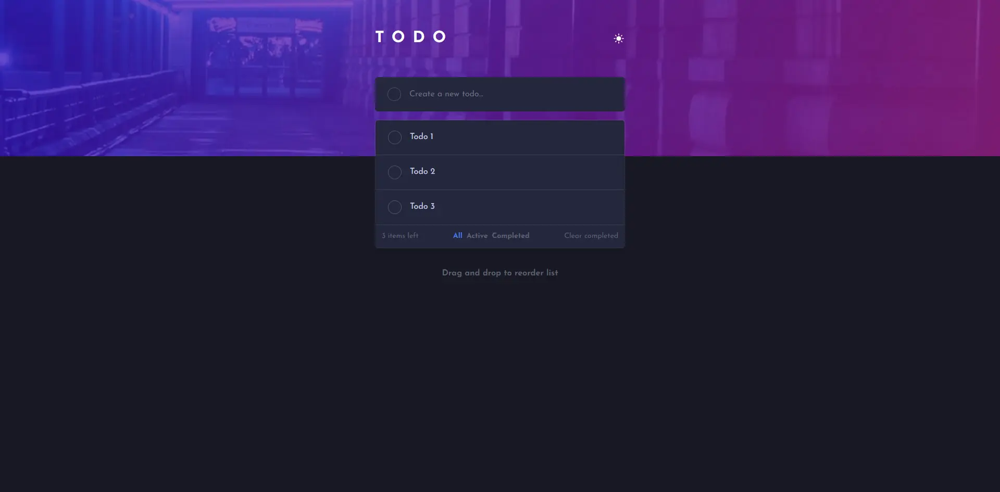
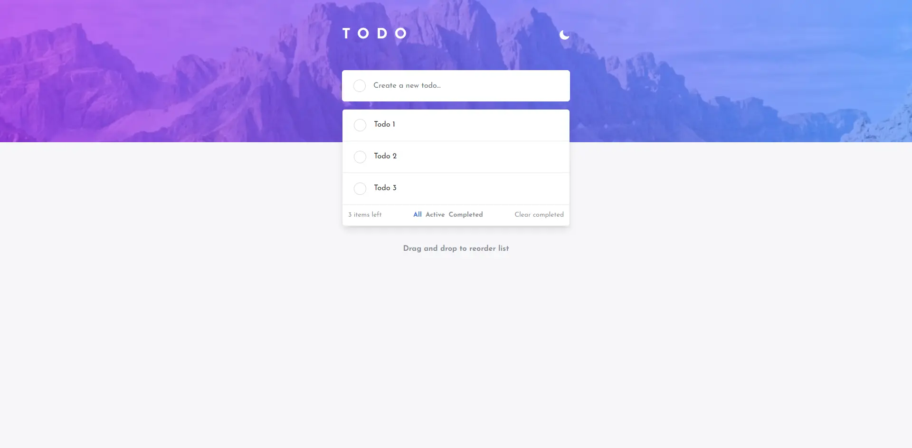
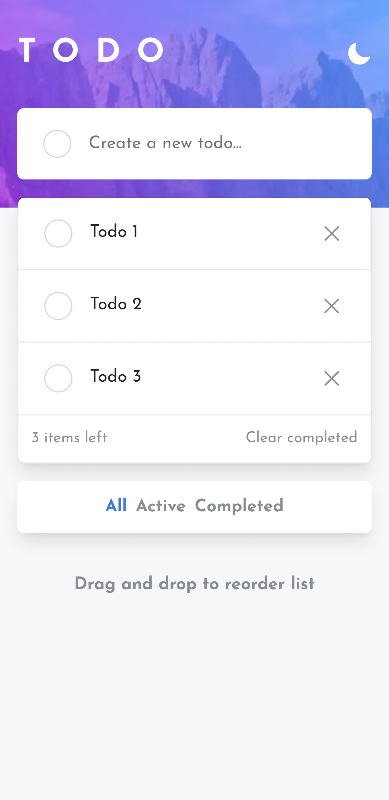

# Frontend Mentor - Todo app solution

This is a solution to the [Todo app challenge on Frontend Mentor](https://www.frontendmentor.io/challenges/todo-app-Su1_KokOW). Frontend Mentor challenges help you improve your coding skills by building realistic projects. 

## Table of contents

- [Overview](#overview)
  - [The challenge](#the-challenge)
  - [Screenshot](#screenshot)
  - [Links](#links)
- [My process](#my-process)
  - [Built with](#built-with)
  - [What I learned](#what-i-learned)
  - [Useful resources](#useful-resources)
- [Author](#author)
- [Acknowledgments](#acknowledgments)

## Overview

### The challenge

Users should be able to:

- View the optimal layout for the app depending on their device's screen size
- See hover states for all interactive elements on the page
- Add new todos to the list
- Mark todos as complete
- Delete todos from the list
- Filter by all/active/complete todos
- Clear all completed todos
- Toggle light and dark mode
- **Bonus**: Drag and drop to reorder items on the list

### Screenshot

### Screenshot 1

### Screenshot 2

### Screenshot 3

### Links
- Solution URL: [Github Repository](https://github.com/RafaelSS427/todo-app)
- Live Site URL: [Go to live site](https://rafaelss427.github.io/todo-app)

## My process

### Built with

- Flexbox
- Mobile-first workflow
- [React](https://reactjs.org/) - JS library
- [tailwindcss](https://tailwindcss.com/) - For styles

### What I learned
I have improved my CSS skills using tailwindcss.

### Useful resources
- [A simple theme switcher in React for Tailwind CSS](https://dev.to/danhawkins/a-simple-theme-switcher-in-react-for-tailwind-css-1349)

## Author

- Website - [Rafael Sequeira Sandoval](https://www.rafael-sequeira-sandoval.dev)
- Frontend Mentor - [@RafaelSS427](https://www.frontendmentor.io/profile/RafaelSS427)